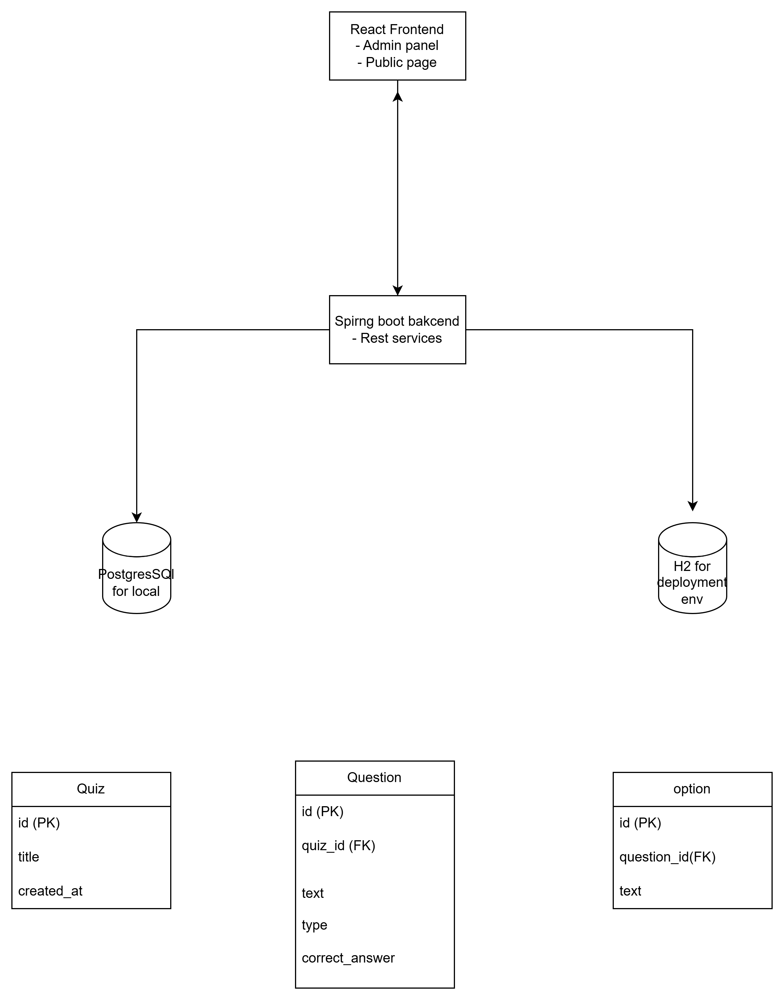

## Assumptions
- This app supports multiple quizzes but user takes them one by one sequentially.
- DB won't have large number of quizzes, so fetching all quizzes at once is acceptable.
- Admin panel will allow only creating quiz.
- UI won't show quiz list. It will automatically start the next quiz after finishing the current one.
- Scoring is calculated per quiz, then accumulated on the UI for the final score.

## Scope
- Admin Panel
  - create quiz with title, question, options, correct answer
- Public page
  - takes quiz one by one
  - view score of each quiz
  - view final score after all quizzes
- Backend
  - store quizzes
  - serve quizzes to public page
  - calculate score
- PostgresSQL for dev and H2 for deployment env.

## High-Level Architecture

